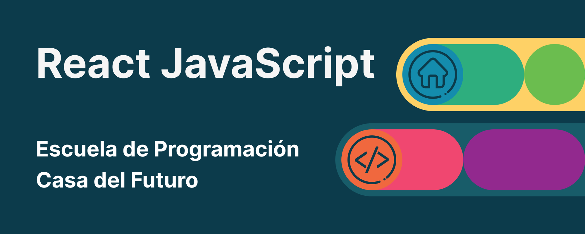

# CURSO DE REACT - JAVASCRIPT

<h2 align="center" style="color:#CD5C5C">J0rg1t0 '777' </h2>

- Link de [Casa del Futuro](https://casa-del-futuro.vercel.app/)
- Link de [GitHub](https://github.com/casa-del-futuro/react/blob/main/02-my-first-app/index.html)
- Link de [Discord](https://discord.gg/aWJEtwyd)
- Link de [Instagram](https://www.instagram.com/casadelfuturo.godoycruz/?hl=es)
- Link de [Clases](https://www.youtube.com/playlist?list=PL0kzc2XH45IYkiA7e4-AVgr67L8XNRWXo)
- Link de [Notion](https://kriptonitx.notion.site/React-JavaScript-b653a44ce0524f5d944826f3a2891017?pvs=4)

